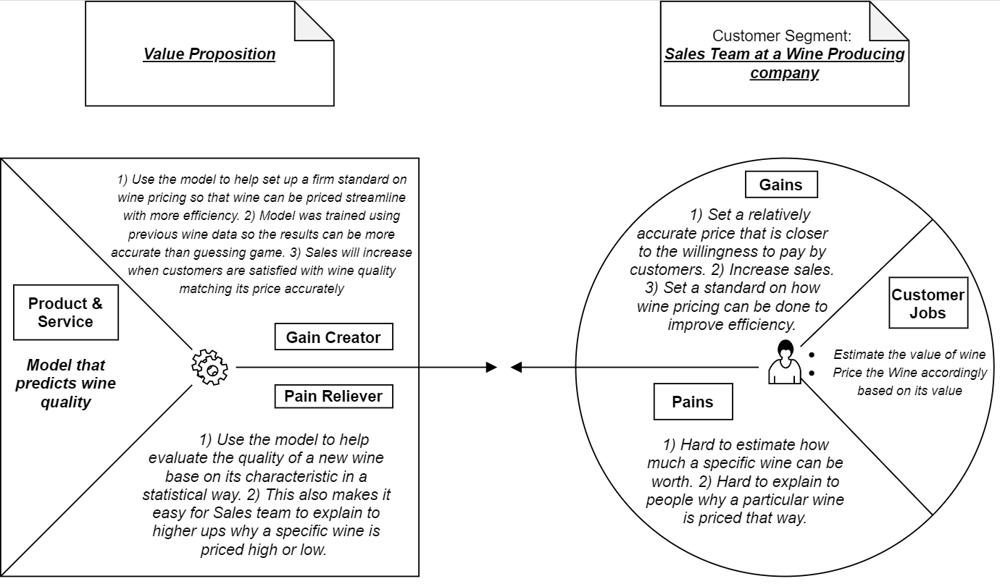

```{r setup, include=FALSE}
knitr::opts_chunk$set(echo = TRUE,
                      cache=TRUE,
                      out.width="100%",
                      warning=FALSE,
                      message=FALSE,
                      clean_cache=TRUE)
```

# Introduction

This article aims to provide a reproducible analytics workflow solving a hypothetical business problem using a predictive regression model on the UCI Wine data. A hypothetical business value proposition along with the full analytics solution will be provided. The important processes will also be documented. You can access teh source code in my GitHub account here: https://github.com/luoy25/ISA616Project.git

## Data Background

The datasets used is obtained from UCI Machine Learning Repository. The two datasets are related to red and white variants of the Portuguese "Vinho Verde" wine. For more details, consult: https://www.vinhoverde.pt/en/ 

## Business Problem

The business background of the project is to provide an analytics solution to the sales team in assisting with predicting wine quality / expert rating using only its chemical feature. The sales team would like to estimate on the wine quality before being in an expert so that they can potentially reduce cost by only have the expert rate the wine that's estimated to have higher quality. 

## Business Value Proposition



# Data Overview

## Source of Data

Paulo Cortez, University of Minho, Guimarães, Portugal, http://www3.dsi.uminho.pt/pcortez, A. Cerdeira, F. Almeida, T. Matos and J. Reis, Viticulture Commission of the Vinho Verde Region(CVRVV), Porto, Portugal, 2009

Download red wine dataset: <https://archive.ics.uci.edu/ml/machine-learning-databases/wine-quality/winequality-red.csv>

Download white wine dataset: <https://archive.ics.uci.edu/ml/machine-learning-databases/wine-quality/winequality-white.csv>

## Dataset Description

The datasets include 12 variables: 

Input variables: 

 * fixed.acidity
 * volatile.acidity
 * citric.acid
 * residual.sugar
 * chlorides
 * free.sulfur.dioxide
 * density
 * pH
 * sulphates
 * alcohol
 * quality

Output Variable:

 * wine.type (Score between 0 and 10)

For more information, read from this file: <https://archive.ics.uci.edu/ml/machine-learning-databases/wine-quality/winequality.names>

## A Glimps of Data {.tabset .tabset-fade .tabset-pills}

There are 12 columns available in both datasets. We can see that both datasets have the same attributes with the same data type, therefore it is reasonable for them to be combined.

```{r}
wineRed = read.csv("winequality-red.csv",sep = ";")
wineWhite = read.csv("winequality-white.csv",sep = ";")
```

### RedWine {-}

```{r}
head(wineRed)
```

### RedWine Structure{-}

```{r}
str(wineRed)
```

### WhiteWine {-}

```{r}
head(wineWhite)
```

### WhiteWine Structure{-}

```{r}
str(wineWhite)
```


# Data Preprocessing

Before we work on preparing the data, we need to load the needed libraries and also create functions(if needed) for further analysis. 

```{r}
# Load required packages
if(require(pacman)==FALSE) 
  install.packages("pacman")
pacman::p_load(tidyverse,hexbin,caret,car,DataExplorer,kableExtra,MLmetrics)
```

```{r}
# Create Metadata Function
Metadata<-function(df){
  library(DataExplorer)
  library(kableExtra)
  z<-introduce(df)
  z<-as.data.frame(t(z))
  colnames(z)<-c()
  knitr::kable(
    z,
    caption="Data Introduction"
  ) %>% kable_styling(bootstrap_options = c("striped", "hover"),
                      full_width = F,
                      font_size = 12,
                      position = "left")
  
}

# Create Model Evaluation Function
Evaluation <- function(model, y_pred, y_true) {
  library(MLmetrics)
  adjr2 <- summary(model)$adj.r.squared
  mse <- MSE(y_pred, y_true)
  rmse <- RMSE(y_pred, y_true)
  mae <- MAE(y_pred, y_true)
  print(paste0("Adjusted R-squared: ", round(adjr2, 4)))
  print(paste0("MSE: ", round(mse, 4)))
  print(paste0("RMSE: ", round(rmse, 4)))
  print(paste0("MAE: ", round(mae, 4)))
}
```

## Missing Data

Based on the output below, we can see that there are no missing data present in both red and white wine datasets. 


```{r}
library(tidyverse)
wineRed %>% is.na() %>% colSums()
wineWhite %>% is.na() %>% colSums()
```

## Merging Datasets {.tabset .tabset-fade .tabset-pills}

We learned earlier that both datasets has same attributes so it makes sense for us to combine them. The different wine types are transformed into dummies and stored in a categorical variable named wine.type. 

```{r}
# Create Dummies
wineRed$wine.type <- 1
wineWhite$wine.type <- 0

# Check Dimensions
dim(wineRed)
dim(wineWhite)

# Combine dataframes
wine = rbind(wineRed, wineWhite)

# Recode attribute as factor
wine$wine.type <- as.factor(wine$wine.type)

# Double check dimension
dim(wine)
```

### MetaData For Red Wine {-}

```{r echo=FALSE}
source("Functions.R")
Metadata(wineRed)
```

### MetaData For White Wine {-}

```{r echo=FALSE}
source("Functions.R")
Metadata(wineWhite)
```

### MetaData For Wine {-}

```{r echo=FALSE}
source("Functions.R")
Metadata(wine)
```


# Explanatory Data Analysis

To explore the dataset, we can take a look at a scatterplot for the response. We will use histograms for numerical variables, bar chart for categorical variables. Some  other summarized statistics were also shown down below. 

## Dataset Summary {.tabset .tabset-fade .tabset-pills}

From the scatterplot, we cannot see any obvious trend between any variables and response. 

From the histogram, we can see that most numeric variables are right skewed and unimodel which makes sense as these variables can't have negative values. PH and quality are both normally distributed. Total sulfur dioxide seems to be bimodel.

The barplot shows the distribution of red and white wine with more white wine in the data. 

### Head of Wine {-}

```{r}
head(wine)
```

### Scatterplot {-}

```{r}
## Scatterplot `quality` with all other continuous features
plot_scatterplot(split_columns(wine)$continuous, by = "quality", sampled_rows = 1000L)
```

### Histograms {-}

```{r}
library(DataExplorer)
plot_histogram(wine)
```

### Bar Plot {-}

```{r}
library(DataExplorer)
plot_bar(wine)
```

### Statistical Summary {-}

```{r}
summary(wine)
```

### Data Structure {-}

```{r}
str(wine)
```

## Correlation & Multicolinearity

### Correlation Plot

```{r}
library(DataExplorer)
plot_correlation(wine, type = "c")
```

### Strong Correlations

Based on the correlation plot above, some of the predictors have strong correlations: 

 * Between density and alcohol (-0.69)
 * Between free.sulfur.dioxide and total.sulfur.dioxide (0.72)

These strongly correlated variable could potentially lead to multicolinearity. 

# Modeling

## Spliting Data

To build the model, I will split it up the dataset into 75% of data for train datasets and 25% of data for test datasets.

```{r}
set.seed(13)
trainIndex = sample(1:nrow(wine), size = round(0.75*nrow(wine)), replace=FALSE)
train<-wine[trainIndex, ]
valid<-wine[-trainIndex, ]
nrow(train)
nrow(valid)
```

## Stepwise Model

We will feed all predictors to create a full model, and then run a stepwise model from both directions. I have eliminated the summary for full model and show the summary for the final stepwise model down below. 

```{r}
library(MASS)
options(scipen=999)
# Fit the full model 
full <- lm(quality ~., data = train)
# Stepwise regression model
step <- stepAIC(full, direction = "both", trace = FALSE)
summary(step)
```

# Results and Performance

The final stepwise model consists of the following equation: 

$\hat{Y} = \hat{\beta_0} + \hat{\beta_1}x_1+\hat{\beta_2}x_2+\hat{\beta_3}x_3+\hat{\beta_4}x_4+\hat{\beta_5}x_5+\hat{\beta_6}x_6+\hat{\beta_7}x_7+\hat{\beta_8}x_8+\hat{\beta_9}x_9+\hat{\beta_{10}}x_{10}$

where the following are values form the $\hat{\beta_0}$ to $\hat{\beta_{10}}$ and from $x_1$ to $x_{10}$: 

```{r}
step$coefficients
```

## Model Interpretation

Based on the equation, we can interpret  $\hat{\beta_0}$ as the Y-Intercept of the line. Meaning that when all chemicals have a value of 0, the quality of the wine on average is 117.8048. It is not realistic as the rating only ranges from 0 to 10. As for other $\hat{\beta}$s, we can interpret them as when there is an increase of any in $x_i$, the corresponding $\hat{\beta_i}$ will adjust according to the value. 

As an example, to interpret the intercept of pH, we can say that when there is a 1 unit increase in $x_{pH}$, on average, there will be a 0.6013 unit increase in the quality of the wine, holding all other variables constant. 

## Predicitons

Although we can interpret the model this way, the main goal of this model is to predict the quality of wine based on its chemical features, and therefore we would like to make some predictions using the model. The predicitons will be made on both training and validation data so that we can use them for evaluation. 

### Using training data

```{r}
p.train<-predict(step, newdata=train)
head(p.train)
```

### Using validaiton data

```{r}
p.valid<-predict(step, newdata=valid)
head(p.valid)
```

## Model Evaluation

To evaluate the model performance, we are using the pre-written function to provide us with some of the useful metrics. Although we are more interested in the predictions made on the validation data, we want to compare there numbers between the training and validation data to prevent overfitting. The metrics used are: Mean Squared Error (MSE), Root Mean Squared Error(RMSE), Mean Absolute Error(MAE) and adjusted R-squared. 

### Evaluation on training data

```{r}
source("Functions.R")
Evaluation(step, p.train, train$quality)
```

### Evaluation on validation data

```{r}
source("Functions.R")
Evaluation(step, p.valid, valid$quality)
```

As we can see from the results above, there seems to be no overfitting issues as the results for training data is similar to that of validation data. The model seemed to even performed slightly better on the validation dataset as we have a slightly lower RMSE of 0.7319 compared to 0.7334. We have an adjusted R-squared of 0.2977 meaning that on average 29.77% of the variation can be explained by the model. 

# Conclusion

## Project Results

To conclude from this project, here are some of the main points covered: 

 * A linear stepwise model has been created. The target variable is quality, whereas the predictors used were attributes of physicochemical tests.
 * The final stepwise model equation is as following, see interpretations from the Results and Performance Section: 
 $\hat{Y} = \hat{\beta_0} + \hat{\beta_1}x_1+\hat{\beta_2}x_2+\hat{\beta_3}x_3+\hat{\beta_4}x_4+\hat{\beta_5}x_5+\hat{\beta_6}x_6+\hat{\beta_7}x_7+\hat{\beta_8}x_8+\hat{\beta_9}x_9+\hat{\beta_{10}}x_{10}$
 * The model was evaluated using MSE, RMSE, ASE, and Adjusted R-Squared.

## Business Value

To reflect on the business purpose and value proposition: 
 
 * We are able to use this model to predict wine quality using its physicochemical features with a 29.77 % of the variation being explained by the model.
 * Tho the model performance is not ideal, it is still an improvement with solving the given business problem. It is also important to note that it is hard to improve the performance of the model as we see almost no correlation between the predictors and target from the scatterplots. 
 * The sales team of the wine company can use this model to have a rough estimation of their new wine's quality before actually bring in an expert. This may help with reducing costs from bringing in the wine experts for wine with extremely poor quality. 

## Reflection and Improvements

To reflect on the process, here are some related thoughts: 

 * Removing outliers were attempted but the model was not improved significantly and therefore it was eliminated from the report.
 * Version control was helpful as it helped with tracking progress and updates.
 * Further analysis can be conducted in the future by trying different model building methods, conducting a PCA for correlated variables and reducing dimensions, or implementing interaction terms. 

