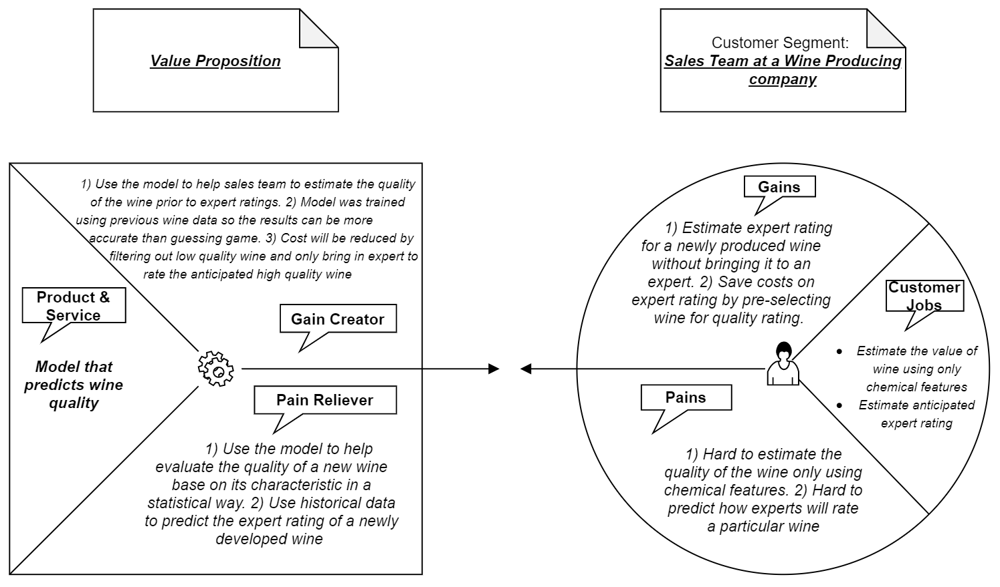

```{r setup, include=FALSE}
knitr::opts_chunk$set(echo = TRUE,
                      cache=TRUE,
                      out.width="100%",
                      warning=FALSE,
                      message=FALSE,
                      clean_cache=TRUE)
```
Outline
0 Introduction
    In this paper......
    An overview of the purpose of your analysis including details or references necessary.
    
1 Overview
1.1 Business Problem
1.2 Business Value Proposition

2 Data Description
◦the source
◦the variables with definitions or a link to a codebook
◦the number of observations in your data set
◦detail on missingness
◦a glimpse of your data if possible (e.g. head and tail)

3 Data Preprocessing
◦Feature generation
◦Imputation
◦Cleaning or merging of categories
◦Outlier removal
◦Anything that changes your data from the original form

4.Your Final Analysis in small pieces with annotation
5.Graphs to visualize different steps in your analysis
6.Clear discussion of why you made analysis choices
7.References to papers or citations you used to make decisions about the analysis

Questions to ask: business value proposition, Downloading data, bibliography 


# Introduction

## Data Background

The two datasets are related to red and white variants of the Portuguese "Vinho Verde" wine. For more details, consult: Web Link or the reference Cortez et al., 2009. 

## Business Problem

## Business Value Proposition


## Source of Data

Paulo Cortez, University of Minho, Guimarães, Portugal, http://www3.dsi.uminho.pt/pcortez, A. Cerdeira, F. Almeida, T. Matos and J. Reis, Viticulture Commission of the Vinho Verde Region(CVRVV), Porto, Portugal, 2009

Download red wine dataset: <https://archive.ics.uci.edu/ml/machine-learning-databases/wine-quality/winequality-red.csv>

Download white wine dataset: <https://archive.ics.uci.edu/ml/machine-learning-databases/wine-quality/winequality-white.csv>

## Dataset Description

Download available at: <https://archive.ics.uci.edu/ml/machine-learning-databases/wine-quality/winequality.names>

## A Glimps of Data {.tabset .tabset-fade .tabset-pills}
```{r}
wineRed = read.csv("winequality-red.csv",sep = ";")
wineWhite = read.csv("winequality-white.csv",sep = ";")
```

### RedWine {-}
```{r}
head(wineRed)
```

### RedWine Structure{-}
```{r}
str(wineRed)
```

### WhiteWine {-}
```{r}
head(wineWhite)
```

### WhiteWine Structure{-}
```{r}
str(wineWhite)
```


# Data Preprocessing

## Missing Data
```{r}
library(tidyverse)
wineRed %>% is.na() %>% colSums()
wineWhite %>% is.na() %>% colSums()
```
There are no missing data present in both red and white wine datasets

## Merging Datasets {.tabset .tabset-fade .tabset-pills}
```{r}
wineRed$wine.type <- 1
wineWhite$wine.type <- 0
dim(wineRed)
dim(wineWhite)
wine = rbind(wineRed, wineWhite)
wine$wine.type <- as.factor(wine$wine.type)
dim(wine)
```

### MetaData For Red Wine {-}
```{r echo=FALSE}
library(DataExplorer)
library(kableExtra)
z<-introduce(wineRed)
z<-as.data.frame(t(z))
colnames(z)<-c()
knitr::kable(
   z,
  caption="Data Introduction"
  ) %>% kable_styling(bootstrap_options = c("striped", "hover"),
                full_width = F,
                font_size = 12,
                position = "left")
```

### MetaData For White Wine {-}
```{r echo=FALSE}
library(DataExplorer)
library(kableExtra)
z<-introduce(wineWhite)
z<-as.data.frame(t(z))
colnames(z)<-c()
knitr::kable(
   z,
  caption="Data Introduction"
  ) %>% kable_styling(bootstrap_options = c("striped", "hover"),
                full_width = F,
                font_size = 12,
                position = "left")
```

### MetaData For Wine {-}
```{r echo=FALSE}
library(DataExplorer)
library(kableExtra)
z<-introduce(wine)
z<-as.data.frame(t(z))
colnames(z)<-c()
knitr::kable(
   z,
  caption="Data Introduction"
  ) %>% kable_styling(bootstrap_options = c("striped", "hover"),
                full_width = F,
                font_size = 12,
                position = "left")
```


# Data Overview

## Dataset Summary {.tabset .tabset-fade .tabset-pills}

### Head of Wine {-}
```{r}
head(wine)
```

### Histograms {-}
```{r}
library(DataExplorer)
plot_histogram(wine)
```

### Bar Plot {-}
```{r}
library(DataExplorer)
plot_bar(wine)
```

### Statistical Summary {-}
```{r}
summary(wine)
```

### Data Structure {-}
```{r}
str(wine)
```

### Correlation Plot {-}
```{r}
library(DataExplorer)
plot_correlation(wine, type = "c")
```


# Analysis and Modeling

## Spliting Data
```{r}
set.seed(13)
trainIndex = sample(1:nrow(wine), size = round(0.75*nrow(wine)), replace=FALSE)
train<-wine[trainIndex, ]
valid<-wine[-trainIndex, ]
nrow(train)
nrow(valid)
```

## Stepwise Model
```{r}
library(MASS)
# Fit the full model 
full <- lm(quality ~., data = train)
# Stepwise regression model
step <- stepAIC(full, direction = "both", trace = FALSE)
summary(step)
```

## Prediciton using Validaiton data
```{r}
p.valid<-predict(step, newdata=valid)
head(p.valid)
```

## Model Evaluation
```{r}
library(caret)
RMSE(p.valid, valid$quality)
R2(p.valid, valid$quality)
```

## One number

```{r pressure,results='asis'}
pressure
paste("The mean pressure is:", round(mean(pressure$pressure),3), "mm")
```

## A table


```{r pressureTable}
library(knitr)
kable(head(pressure), format="pipe", digit=3)
kable(tail(pressure), format="pipe", digit=3)
```


# Including Plots {.tabset .tabset-fade .tabset-pills}

You can also embed plots, for example:

## Plotly {-}

```{r pressurePlot, echo=FALSE}
library(plotly)
plot_ly(pressure, x=~temperature, y=~pressure, type="scatter",mode="lines+markers")
```

## Map {-}

```{r fsbLoc, echo=FALSE}
library(dplyr)
library(leaflet)
leaflet()%>%addTiles%>%
  setView(-84.7298,39.5113,zoom=17)%>%
  addPopups(-84.7298,39.5113,"we are here")
```

For more details on organizing with tabset go here <https://bookdown.org/yihui/rmarkdown-cookbook/html-tabs.html>.

# Equations

You can include both inline and offset equations.

## Inline equations

You can include inline equations like $y = nx + b$, you can also do more complicated inline equations such as $\hat{y} = \hat{\beta} + \hat{\beta_1}x$

## Offset equations

\begin{euqation}
y=mx+b
\tag{1}
\end{euqation}

# References
